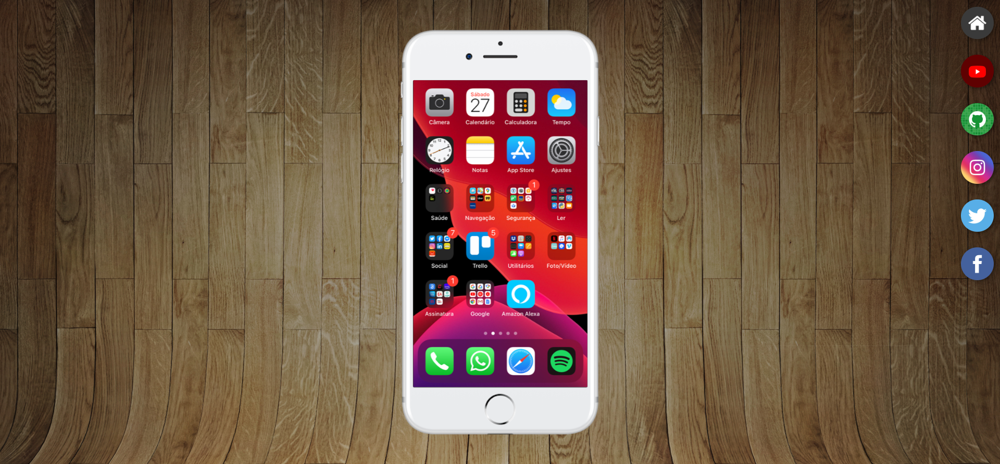

# Projeto Redes Sociais - Curso em Vídeo

Projeto construído durante o curso de HTML5 e CSS3 do Curso em Vídeo.

[Clique aqui para acessar](https://iagovalverde.github.io/projeto-social/)

# Tecnologias

- HTML
- CSS
- Git e Github

# Aprendizagem

- Nesse projeto aprendi a usar iframes
- Usei também imagens no background

## Contato

iagopachiani96@gmail.com